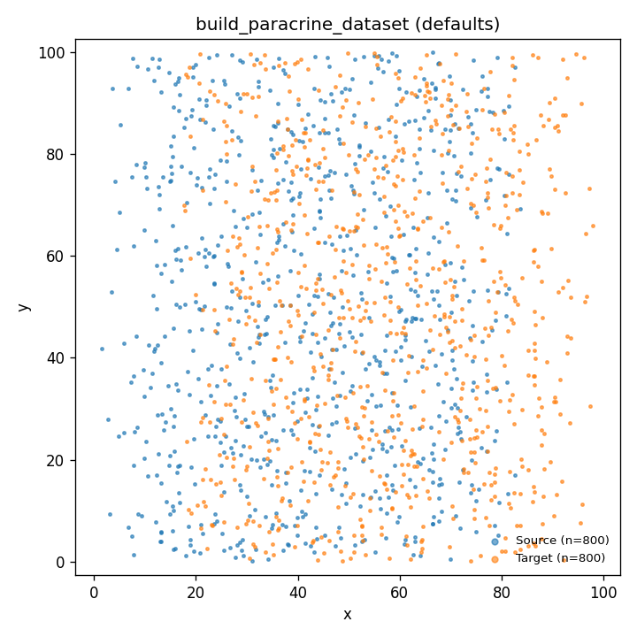
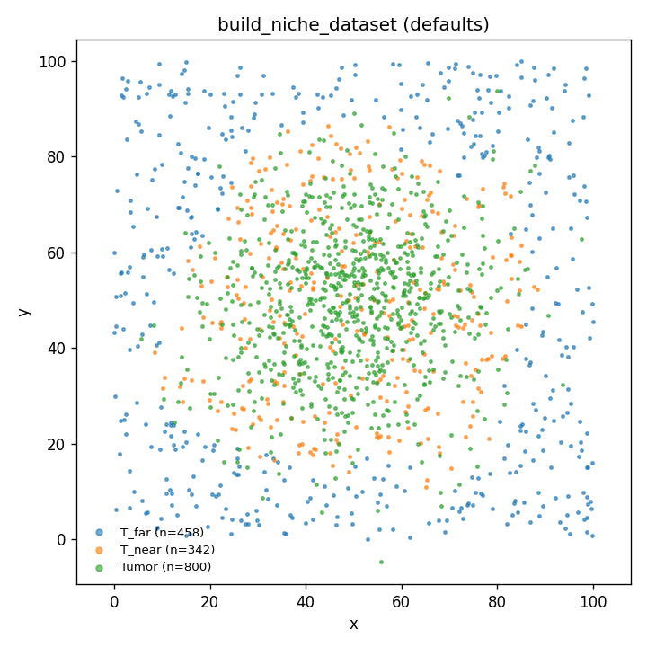
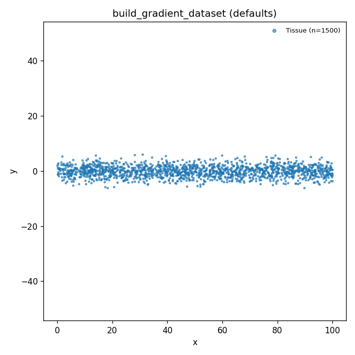
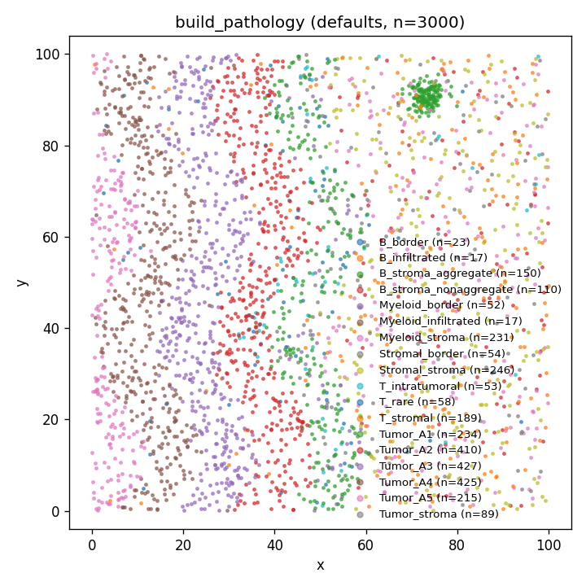

# Synthetic dataset templates

GeneVector ships with a small catalog of synthetic spatial transcriptomics
datasets, each modeling a different biological pathology. They share a common
output contract (AnnData + ground-truth dict) and are useful for benchmarking,
testing, and feature development across spatial-omics tools.

```python
from genevector.benchmarks.synthetic import (
    build_paracrine_dataset,
    build_niche_dataset,
    build_gradient_dataset,
    build_pathology,
    list_templates,
)

print(list_templates())  # → name → description map

adata, ground_truth = build_paracrine_dataset(seed=42)
```

## Shared output contract

Every builder returns `(adata, ground_truth)`.

**`adata` invariants:**

- `adata.X` is `scipy.sparse.csr_matrix` of float counts.
- `adata.obs["phenotype"]` is a categorical with cell-type labels.
- `adata.obsm["spatial"]` is a `np.ndarray` of shape `(n_cells, 2)`, dtype `float64`.
- `adata.var_names` are uppercase strings, unique.

**`ground_truth` schema (v2.0)** — JSON-serializable, all keys present in every template:

```python
{
  "template": str,           # one of: "pathology", "paracrine", "niche", "gradient"
  "version": "2.0",
  "seed": int,
  "params": dict,            # full kwargs the builder was called with
  "phenotypes": {
      "<phenotype_name>": {"n_cells": int, "markers": [str, ...]},
      ...
  },
  "genes": {
      "<gene_name>": {"role": str, "phenotype": str | None, "metadata": dict},
      ...
  },
  "pairs": [
      {"gene_a": str, "gene_b": str, "kind": str, "metadata": dict},
      ...
  ],
}
```

`role` values: `"identity_marker"`, `"ligand"`, `"receptor"`, `"niche_gene"`,
`"axial_gradient"`, `"housekeeping"`, `"rare_subtype_marker"`. Extensible — new
templates may add roles.

`kind` values for pairs:

- `"paracrine"`: `gene_a` expressed on phenotype X, `gene_b` on phenotype Y, with X and Y spatially adjacent.
- `"niche_induction"`: `gene_a`'s expression in a cell depends on the local density of cells expressing `gene_b`.
- `"axial_gradient"`: both genes vary along a 1D axis with known correlation; `metadata["correlation_sign"]` is +1, 0, or -1.
- `"shared_program"`: both genes co-expressed on the same phenotype — the trivial within-cell case.

Templates are *atomic*: they don't compose. To combine pathologies, run multiple builders and merge the AnnData objects yourself.

## Templates

### `build_paracrine_dataset`

Two-cell-type paracrine signaling. Two intermixed populations ("Source" and
"Target") share neighborhoods. Each LIG/REC pair is independent — a ligand on
Source cells, a receptor on Target cells, never co-expressed in the same cell.

**Parameters**

- `n_pairs` (default 5): number of independent ligand-receptor pairs.
- `n_cells_per_type` (default 2000): cells per phenotype.
- `mixing` (default 0.7): 0 = fully segregated populations, 1 = uniformly mixed. Adjacency frequency scales with this parameter.
- `expression_density` (default 0.3): fraction of cells of the relevant type that express each LIG/REC.
- `n_identity_markers` (default 10): identity markers per cell type. Set to 0 for a "pure" paracrine signal with no competing within-cell structure.
- `bounds` (default `(0, 100)`), `scale_mean`, `scale_std`, `background_noise`: scale parameters.
- `seed` (default 42).

**When to use**: testing whether a spatial method can recover ligand-receptor
coupling against a cell-type-identity backdrop. Sweeping `mixing` from 0 to 1
shows the spatial-signal strength gradient.



### `build_niche_dataset`

Tumor blob with surrounding T cells. T cells whose neighborhood (within
`niche_radius`) has a tumor fraction above `niche_threshold` express NICHE
genes; T cells far from the tumor do not. The split produces `T_near` /
`T_far` phenotypes that share T-cell identity markers — the only
distinguishing signal is niche-gene activation.

**Parameters**

- `n_niche_genes` (default 5): number of niche genes (NICHE_0..N-1).
- `n_tumor_cells`, `n_t_cells` (defaults 2000, 1500): cell counts.
- `tumor_blob_std` (default 15.0): std of Gaussian blob for tumor placement.
- `niche_radius` (default 8.0), `niche_threshold` (default 0.3), `niche_k` (default 10.0): induction parameters. Trigger probability is `sigmoid(k * (tumor_frac_in_radius - threshold))`.
- `n_identity_markers` (default 10): identity markers per cell type.
- `seed` (default 42).

**When to use**: testing whether a spatial method can recover gene programs
that are induced by neighborhood density rather than by within-cell coupling.
`graph_xcorr` should recover NICHE × tumor-marker correlation; `mi` and
`pearson` should not.



### `build_gradient_dataset`

1D axial pathology — cells along a line with smooth gradient and peaked gene
expression. Models tissue structures with a dominant axis (crypt-villus,
neural-tube dorsoventral patterning).

**Parameters**

- `n_cells` (default 3000).
- `n_monotone_genes` (default 5): genes that increase smoothly along the axis (sigmoid centered at midpoint).
- `n_peaked_genes` (default 3): genes with a Gaussian peak at the axis midpoint.
- `axis_length` (default 100.0), `axis_jitter` (default 2.0): geometry.
- `expression_steepness` (default 0.05): sigmoid steepness for monotone genes.
- `n_identity_markers` (default 5): bulk identity markers expressed on every cell.
- `seed` (default 42).

**When to use**: the 1D structure is the regime where `graph_xcorr` most
clearly differs from `mi`: each cell has 2 graph neighbors, axial position
fully determines expression, and neighborhood smoothing recovers the gradient
cleanly.



### `build_pathology`

The full grafiti-derived layout with paracrine, niche, T-rare, and
housekeeping overlays composed into a single rich pathology FOV. Heavier and
biologically richer than the focused templates above. See the
`apply_overlay` and `generate_synthetic_data` docstrings for the full
parameter surface.



## Schema reference

The v2.0 ground-truth schema unifies what was previously a heterogeneous set
of per-template keys into three collections: `phenotypes`, `genes`, and
`pairs`.

- **`phenotypes`** is a dict keyed by phenotype name. Each entry has `n_cells` and a `markers` list (the canonical identity markers for that phenotype).
- **`genes`** is a dict keyed by uppercase gene name. Each entry has `role`, `phenotype` (the phenotype the gene is most associated with, or null), and a `metadata` dict for role-specific parameters (e.g., `niche_radius` for niche genes, `peak_x` for peaked-gradient genes).
- **`pairs`** is a list of typed gene-gene relationships. Each entry has `gene_a`, `gene_b`, `kind`, and a `metadata` dict.

To filter, e.g., all paracrine pairs from any template:

```python
paracrine = [p for p in gt["pairs"] if p["kind"] == "paracrine"]
```

To get all genes with a given role:

```python
ligs = [name for name, g in gt["genes"].items() if g["role"] == "ligand"]
```

## Adding new templates

A new template is a function that:

1. Takes a `seed` kwarg and any other parameters needed.
2. Returns `(adata, ground_truth)` matching the contract above.
3. Uses the helpers in `_shared.py` (`GroundTruth`, `build_anndata`, geometry/expression helpers) so the contract invariants are satisfied automatically.
4. Optionally registers itself in the `_TEMPLATES` dict in `__init__.py` so `list_templates()` discovers it.

New `role` and `kind` strings can be added — the schema is open. Document
them in this file when you do.
